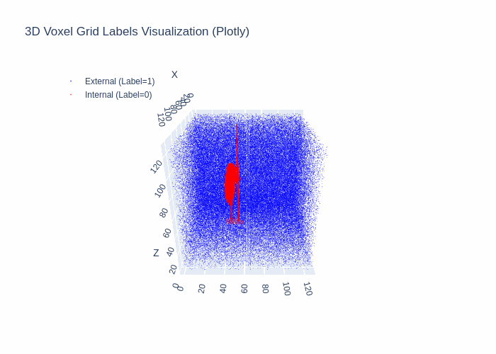
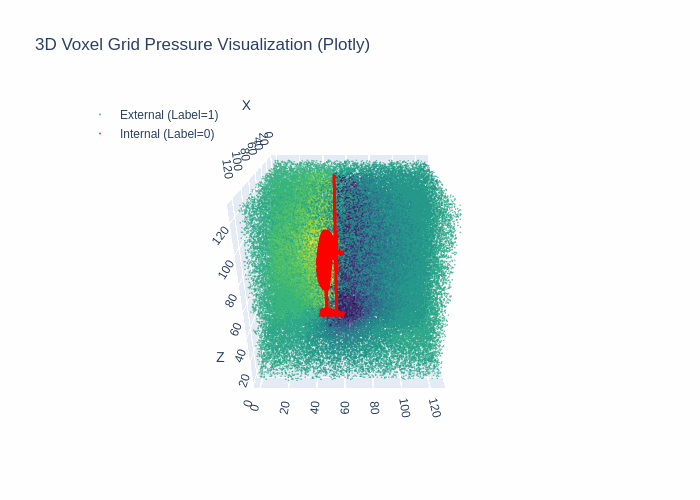
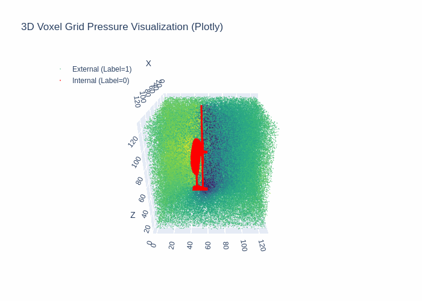
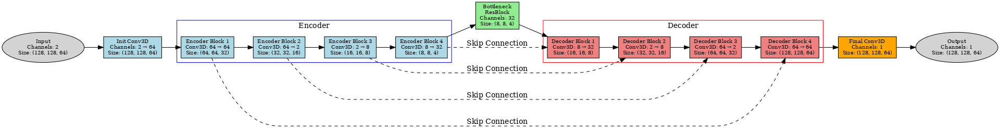

# 3D-Diffusion

## Project Overview

The main goal of this project is to predict the 3D pressure distribution in space around a drone during its flight.

Specifically, the project takes a (128x128x64) 3D tensor as input, representing the shape and position of the drone in 3D space, and outputs a (128x128x64) 3D tensor indicating the pressure distribution in the surrounding 3D space.

<div align="center">
  <h3>Input: Labels (Shape and Position of the Drone)</h3>
  
</div>

<div align="center">
  <h3>Ground Truth and Prediction</h3>
  
  
</div>

## How to Use

Run `train_ddpm_drone.py`. Model-related parameters can be modified in the `Unet` method. The dataset shape can be adjusted in the `GaussianDiffusion` method, while training epochs, learning rate, and other parameters can be updated in the `Trainer` method.

To use `accelerate` for multi-GPU training, execute the following command:

```bash
CUDA_VISIBLE_DEVICES=4,5 PATH="/bin:$PATH" accelerate launch /your/path/scripts/train_ddpm_drone.py
```

If running multiple `accelerate` instances, a `port` conflict may occur. In this case, change the `port` for the second instance, e.g., to `29501`:

```bash
CUDA_VISIBLE_DEVICES=2,3 PATH="/bin:$PATH" accelerate launch --main_process_port=29501 /your/path/scripts/train_ddpm_drone.py
```

Adjust the `CUDA_VISIBLE_DEVICES` parameter based on your requirements.

**With the current model architecture and dataset shape, approximately 30GB of GPU memory is consumed during training.**

## Data Processing

The physical simulation generates a `.dat` dataset with a shape of (37500000x14), where the features are [X, Y, Z, Pressure, Pressure Coefficient, Q-Criterion, Velocity Magnitude, Velocity[i], Velocity[j], Velocity[k], Vorticity Magnitude, Vorticity[i], Vorticity[j], Vorticity[k]]. However, only X, Y, Z, and Pressure are required. The grid shape in the simulation software is (500x500x150).

### Workflow

`generate_drone_dataset.py` is a script designed to process the raw drone data. It converts the raw data stored in `.dat` files into structured voxel grids and saves them as PyTorch tensors suitable for machine learning tasks. The process includes data loading, filtering, label assignment, voxelization, organization, and saving.

1. **Data Loading**
   - Reads all `.dat` files from the specified raw data directory.
   - Each `.dat` file contains point cloud data of the drone, including X, Y, Z coordinates, and pressure values.

2. **Data Filtering**
   - Filters out points with Z-axis coordinates less than or equal to a threshold (`z_threshold`, default: `1e-5`).
   - Retains points with Z-axis coordinates greater than the threshold.

3. **Label Assignment**
   - Assigns labels to each point based on pressure values:
     - Points with pressure values equal to 0 are labeled as **internal points (Label=0)**.
     - Points with pressure values greater than 0 are labeled as **external points (Label=1)**.

4. **Voxelization**
   - Maps points to voxel grids based on their X, Y, Z coordinates.
   - For each voxel:
     - **Labels Voxel Grid:** If at least one external point (Label=1) exists within the voxel, it is labeled as 1; otherwise, 0.
     - **Pressure Voxel Grid:** Calculates the average pressure value of all points within the voxel.

5. **Data Saving**
   - Saves the generated labels voxel grid and pressure voxel grid as PyTorch `.pt` files for training and testing.

6. **Dataset Splitting**
   - Randomly splits processed data files into training and testing sets, with a default ratio of 80% training and 20% testing.

7. **Parallel Processing**
   - Utilizes multi-processing (`ProcessPoolExecutor`) to accelerate large-scale data processing.

### Output Data File Structure

After processing, the data is organized as follows:

```plaintext
/data/sda/tanqiwen/dataset_drone/
├── train/
│   ├── input/
│   │   ├── <filename>_labels.pt
│   │   ├── <filename>_labels.pt
│   │   └── ...
│   └── target/
│       ├── <filename>_pressure.pt
│       ├── <filename>_pressure.pt
│       └── ...
└── test/
    ├── input/
    │   ├── <filename>_labels.pt
    │   ├── <filename>_labels.pt
    │   └── ...
    └── target/
        ├── <filename>_pressure.pt
        ├── <filename>_pressure.pt
        └── ...
```

- **`train/`**: Training data directory.
  - **`input/`**: Stores labels voxel grid files (`<filename>_labels.pt`).
  - **`target/`**: Stores pressure voxel grid files (`<filename>_pressure.pt`).

- **`test/`**: Testing data directory.
  - **`input/`**: Stores labels voxel grid files (`<filename>_labels.pt`).
  - **`target/`**: Stores pressure voxel grid files (`<filename>_pressure.pt`).

## Model Architecture

The 3D Diffusion model replaces all `conv2d` operations in the original Diffusion model with `conv3d` to handle 3D tensors.

<div align="center">
    
</div>
